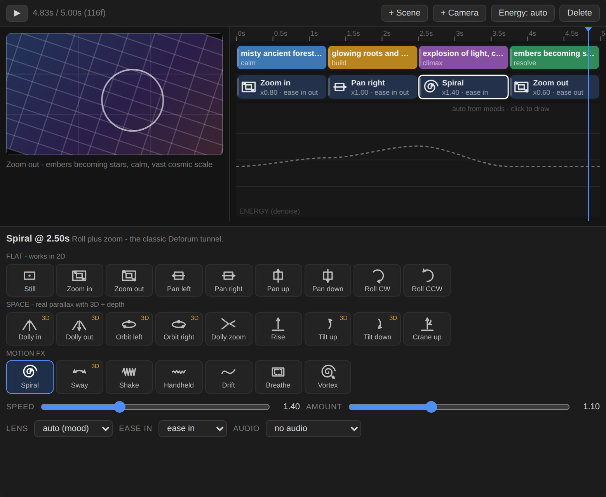

<div align="center">


# Difforum

**Direct the camera. Let any model render it.**

A timeline for ComfyUI: draw scenes, camera moves and energy with the mouse,
then render the shot with MiniMax H3, LTX-2, or the classic Deforum
feedback look. The camera also goes out to After Effects and Blender.

[](https://github.com/chillithebillis/Difforum/actions/workflows/ci.yml)


</div>



## What it does

Video models render well, but you steer them with words. Difforum gives you
back control over the **camera and the timing**:

1. **Direct.** In the **Director** node you lay out *scenes* (prompt + mood), *camera
   moves* (picked from 25 visual presets) and an *energy curve*. Press ▶ to
   preview the move; the preview uses the same engine that renders.
2. **Render.** One `direction` wire goes to the renderer of your choice:

   | Renderer | Difforum node | You get |
   |---|---|---|
   | **MiniMax H3** | H3 Guides / H3 Shot | Your camera turned into keyframes, first/last frames and a camera prompt, with no hand-placed frames. Areas the camera uncovers are painted by **Fill Reveal (AI)** |
   | **LTX-2 / 2.5** | LTX Guides | Keyframes inside the LTX latent |
   | **Any image model** (SDXL, Flux, SD1.5, turbo) | Feedback Sampler | The Deforum look: every frame re-imagines the last |
   | **Realtime** (turbo models, webcam) | Live Sampler | Plays inside the node, with Spout / OBS output |

3. **Finish.** **Camera Export** writes the same camera for After Effects (`.jsx`)
   and Blender (`.py`) so titles, 3D and comp lock to the AI shot.

**Pick a look once.** The Director's `look` (cinematic, documentary,
deforum_morph, animatediff_dream, psychedelic, music_video, stop_motion,
hand_drawn) sets the Feedback Sampler's colour, detail and energy, and adds the
matching style sentence to the H3 / LTX prompt, so the same aesthetic carries
across renderers.

No camera expressions to write. They are still there if you want them.

## Quick start

1. Install from **ComfyUI Manager** (search "Difforum"), or:
   ```bash
   cd ComfyUI/custom_nodes && git clone https://github.com/chillithebillis/Difforum.git difforum
   ```
2. Restart ComfyUI and open **Templates → Difforum**.
3. Start with **`01_storyboard_no_model`**. It needs no model: load a picture, shape the
   timeline, press ▶, then Queue.

## Templates

| # | Template | What it shows | Needs |
|---|---|---|---|
| 01 | `storyboard_no_model` | Direct a shot and preview the whole move in about a second | an image |
| 02 | `feedback_sdxl` | The Deforum look on a modern model | SDXL / SD1.5 / Flux |
| 03 | `parallax_3d_depth` | Real 3D parallax from a depth map | + [DepthAnythingV2](https://github.com/kijai/ComfyUI-DepthAnythingV2) |
| 04 | `audio_reactive` | Camera moves that react to music, with no expressions | + an audio file |
| 05 | `live_turbo` | Realtime feedback, webcam mirror, VJ output | a turbo model |
| 06 | `seamless_loop` | A loop without a crossfade, for installations | a checkpoint |
| 07 | `ltx_guides` | Director keyframes guiding LTX-2 / 2.5 | your LTX graph |
| 08 | `h3_first_last_frame` | **MiniMax H3 FL2VA**: first frame + the frame where your camera ends | MiniMax H3 fl2va |
| 09 | `camera_to_ae_blender` | Camera out to After Effects / Blender, and back in | nothing |
| 10 | `h3_multikeyframe_guides` | **MiniMax H3**: keyframes along your camera, anchored inside the generation | MiniMax H3 ref2va |
| 11 | `h3_deforum_look` | **Deforum / AnimateDiff look with H3 motion**: a turbo feedback pass sets the look, H3 animates between its frames | turbo SDXL + H3 ref2va |

### MiniMax H3 in one picture

```
Load Image ─► Guide Frames ─► Keyframes ─► Fill Reveal (AI) ─► H3 Guides ─► Sampler ─► Video + audio
                  ▲                            ▲
Setup ─► Director (camera, scenes) ─► Camera → Prompt ─► MiniMax H3 Reference to Video
```

The official *Multiframe Reference* template anchors images you place by hand.
Template 10 anchors frames that come **from your camera move**, so H3 performs
the dolly, orbit or crane you drew. Template 08 does the same with H3's
first/last-frame model, and splits clips longer than 20 s into segments.
Both use ComfyUI's core MiniMax H3 nodes.

## The nodes

| Group | Nodes |
|---|---|
| **Setup** | Setup: duration in seconds, aspect, and snapping to each model's grid (H3 17k+5 @ 24 fps, LTX 8k+1, Wan 4k+1) |
| **Direction** | Director (timeline), Camera (keys), Camera (expressions), Storyboard |
| **Curves & prompts** | Schedule, Schedule Plot, Audio Analyzer, Audio Curve, Prompt Travel |
| **Render** | Feedback Sampler, Live Sampler, Render Options |
| **Video model bridges** | Guide Frames, Keyframes, Fill Reveal (AI), Camera → Prompt, H3 Guides, H3 Shot, LTX Guides |
| **Export** | Camera Export (AE / Blender / JSON), Camera Import |
| **Post** | Loop, Symmetry, Echo Trails, Flow Stabilize, Detail Guard |

The full reference is in **[docs/NODES.md](docs/NODES.md)**. Every node also shows its description inside ComfyUI.

## The Deforum look, rebuilt


The Feedback Sampler runs on any image model and fixes what made the original
Deforum hard to use:

- **Depth follows the image**, so parallax stays true for the whole clip.
- **3D moves never freeze.** Without a depth map they become pseudo-3D, and the node says so.
- **Cadence without pops.** Only every Nth frame is diffused; the frames in between are crossfaded.
- **Revealed edges are repainted** instead of smeared.
- **Colour locks per scene**, so prompt travel can change the palette.

## Documentation

| | |
|---|---|
| [Bridges](docs/BRIDGES.md) | MiniMax H3, LTX-2, After Effects, Blender |
| [Node reference](docs/NODES.md) | Every input and output |
| [Performance](docs/PERFORMANCE.md) | Speed vs. quality, Apple Silicon |
| [Models](docs/MODELS.md) | What works well, and the settings |
| [Prompt pack](docs/PROMPTS.md) | Ready-made scene sets |
| [Expressions](docs/EXPRESSIONS.md) | The math syntax, for power users |
| [Migrating from 0.x](docs/MIGRATION.md) | Old workflows still open; the new equivalents |
| [Architecture](docs/ARCHITECTURE.md) | How it is built, for contributors |

## Contributing

`pytest` runs without a GPU or ComfyUI. Templates and the node reference are
generated from the code (`tools/`). See [CONTRIBUTING.md](CONTRIBUTING.md).

MIT licensed.
